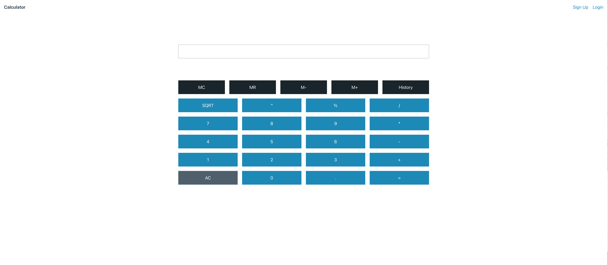

# Calculator

Simple web calculator with basic arithmetic functions using React.js frontend including a Node.j/Typescript service on the backend. <p>


See a [demo](https://calculator-front.onrender.com)

## Design Doc

Can be found [here](./docs/HLD-Calculator.md)

## Running Locally

### 1. Clone Repo

```bash
git clone https://github.com/crspiccin/calculator.git
```

### 2. Setup

Permission for running setup script, if necessary.

```bash
chmod 700 ./setup.sh
```

Runt it

```bash
./setup.sh
```

### 3. Run App

#### View

Run the frontend, go to **view** folder and run:

```bash
npm start
```

#### App

On a new terminal run the backend, go to **app** folder and run:

```bash
npm run dev
```

### 4. Use it

You should be able to go to [](http://localhost:3000) and use the application

## Configuration

When deploying the application, the following environment variables must be set:

| Environment Variable   | Default value           | Description                    |
| ---------------------- | ----------------------- | ------------------------------ |
| DB_NAME                | calculator.db           | Name of SQL Lite database file |
| PORT                   | 3010                    | Backend service port           |
| REACT_APP_PRO_BACK_URL | `http://localhost:3010` | Backend service url            |
