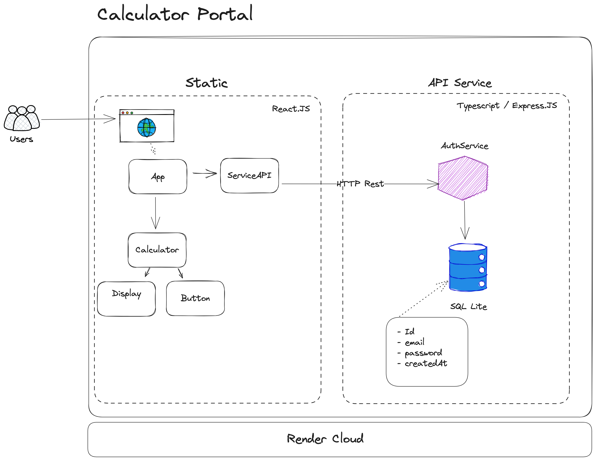

# Technical specification - Calculator Web

## Context

Currently, our users complaint about the lack of confidence when making basic math operations like addition, subtraction, multiplication and division and based on these and others needs, we are going to construct a new calculator portal. This portal should have the following requirements:

- The calculator should have a browser-based user interface (ie it can be opened using a web
  browser)
- The calculator should have a number pad with digits 0-9 and decimal point
- The calculator should have buttons for addition, subtraction, multiplication, and division
- The calculator should have a display that shows the input and the result of the calculation
- The calculator should follow the order of operations (PEMDAS)
- The calculator should have a way to sign up with a username and password
- The calculator should have a way to log in with username and password
- The calculator should have a backend service to handle authentication
- The calculator should be usable with or without authentication
- The calculator should have a navigation bar or panel which displays the user’s authentication status
- The calculator should have the following features:
  - Memory functions (M+, M-, MR, MC)
  - Percentage function (%)
  - Square root function (√)
  - Exponential function (^)
  - History function

## Decision

Based on those features we are proposing the following solution design.

### HLD (High Level Design)

Our proposal is to create a solution composed by the following modules:

### Calculator

- For our calculator, as its a enclosed domain without external intergrations necessity - only pure math, we are going to process all calculator engine on the frontend.
- We choose React.js as our frontend engine, given the broad use and community, besides the fact it makes easier to encapsulate logic and to work with html events and rendering.
- Our structure will have a Calculator component with states processing all the math engine, being a parent component, a Button component representing an operation, digit, memory, etc and a Display representing the math result.

### Authentication

- We must create an authentication service, this service will expose a REST interface with signup en login operations, and we choose to use typescript based on Express.js
- We are going to create an simple mechanism with user and password on our database, the user password will be encrypted.
- Initially, we are going to use SQL database, as we have only one single instance for our MVP ,we can use SQL Lite as our SQL database engine.
- The service must follow the Onion Architecture, in this type of architecture, the service and entities are agnostic on the technologies that we are using to expose and persist information, only taking care on the businness rules. It will make easier in the future if we need change how to expose the application, changing databases, inject unit tests, etc.

### Deploy

- To deploy our application, we need commit on the main branch. If we follow a trunk based develoopment, once a PR is approved and the code merge into main, it will deployed on the cloud and be online.

## Consequences

- Free costs to run our MVP, we can iterate with our initial users and get feedback for free.
- It's important to mention that our choice towards SQL Lite is based currenlty on the small size of our application, we are testing and using a small workload without multiples instances, but as our application scale, we need rethink our database strategy, choosing a database where we can afford multiple connections from multiples services instances.
- Since we are using a free hosting (Render) initially, eventually we are going to face latency in our login and signup process, we can move from the free tier to the paid tier or move to another cloud provider offering more tools as we grow and our architecture turning more complex.
- Our log system is very basic using only console.log and console.error which is not the ideal, in the long run we must change this model using a more robust alternative like winston.
- For demonstration purposes we are going to use local storage to store user session, but in future for security sake, we are planning to use cookies with JWT to persist session authentication.

##### References

- [Onion Architecture](https://www.codeguru.com/csharp/understanding-onion-architecture/)
- [Render - Free instance](https://render.com/docs/free)
